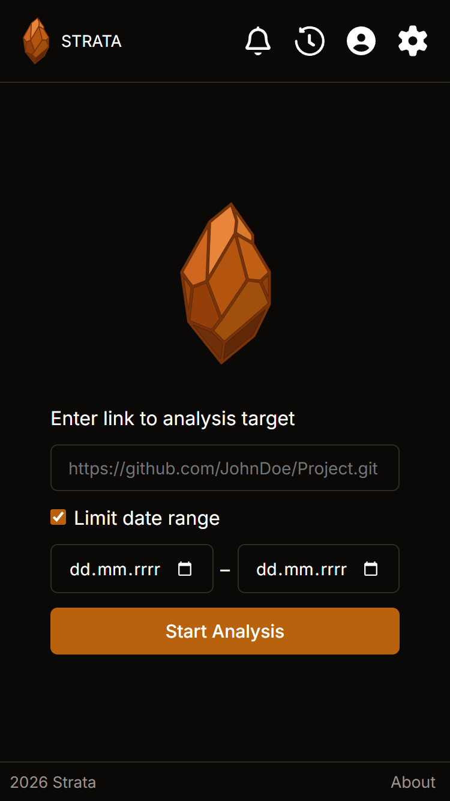
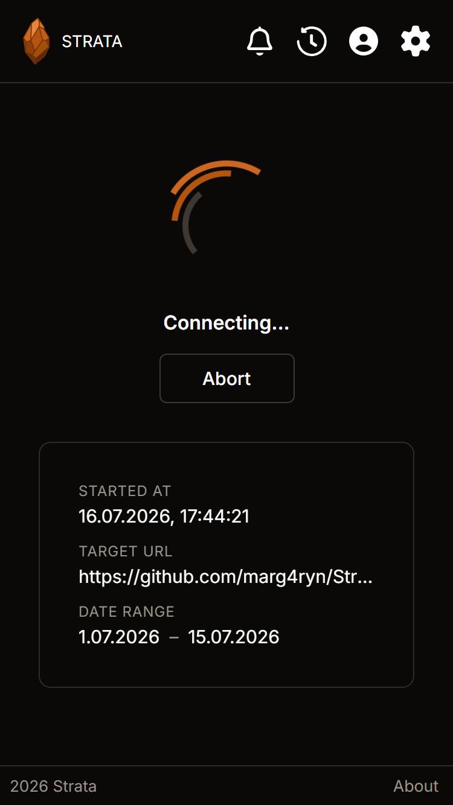
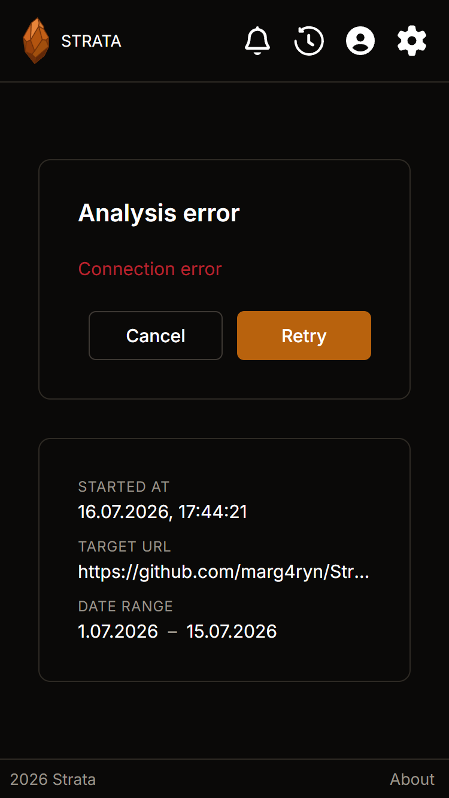
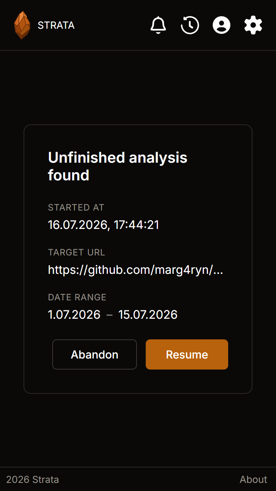

# STRATA

## 📖 About

**Strata** is a modern tool that serves as an intelligent navigation system for complex code repositories. Most large software projects resemble living yet intricate organisms in which it is easy to lose orientation. Instead of relying on static file browsing, the application analyzes change history and the dynamics of software evolution. This allows teams to better understand how their work evolves and to precisely identify areas that require special attention. Strata transforms raw data from version control systems into clear and readable information, facilitating proactive management of technical debt in large-scale software systems.

The project abandons conventional tables in favor of an intuitive **_3D code city_** visualization. In this model, each file is represented as a building whose dimensions reflect key metrics: height symbolizes the intensity of work on a given component, while width corresponds to its physical size. This form of presentation enables users to instantly spot _skyscrapers_ – critical parts of the system around which the greatest development effort is concentrated. Thanks to the interactive map, developers can quickly identify areas of highest activity, significantly accelerating the auditing process without the need for tedious report analysis.

The application's name refers to rock strata – layers that accumulate over time, recording the history of everything that shaped them. In the context of software development, these layers correspond to the evolving history of a codebase, where high complexity coinciding with frequent changes forms so-called **_hotspots_**. Strata acts as a powerful spotlight, illuminating these highly active regions that often remain hidden in traditional analyses. By precisely identifying critical points, the tool enables teams to focus their attention and resources where intervention is most needed, reducing the risk of failures and supporting long-term, sustainable system maintenance.

Strata recognizes that software is ultimately the result of human collaboration and therefore provides insights into team dynamics. The application visualizes knowledge flow and the distribution of contributions across individual modules, supporting the development of more informed and cohesive development teams. It enables the identification of centers of expertise and facilitates communication through a clear presentation of code ownership history. This human-centered approach makes the software development process more transparent and less stressful, encouraging a culture of knowledge sharing within the organization.

## ✨ Features

### Running Analyses

To start an analysis, the user provides the URL of the target Git repository. Optionally, they can specify a date range to limit the analysis; otherwise, the repository's entire commit history is processed by default (see the **Target Form** below). 

During the analysis, the application displays real-time progress updates delivered by the server over a WebSocket connection, allowing users to monitor each stage of the process (see the **Loading Screen** below).

Multiple analyses can be executed simultaneously in separate tabs, enabling users to work on different repositories independently. If an error occurs or the WebSocket connection is interrupted, the application allows the user to reconnect and resume receiving status updates without restarting the analysis (see the **Analysis Error** below).

An analysis continues running even if the application is closed. When the user returns later, Strata automatically detects any unfinished analysis and offers the option to reconnect to it (see the **Unfinished Analysis** below).

Application state is synchronized across browser tabs using Local Storage, while the Web Locks API prevents multiple tabs from competing for the same resources, ensuring consistent and reliable behavior.

| Target Form | Loading Screen | Analysis Error | Unfinished Analysis |
|:---:|:---:|:---:|:---:|
|  |  |  |  |
