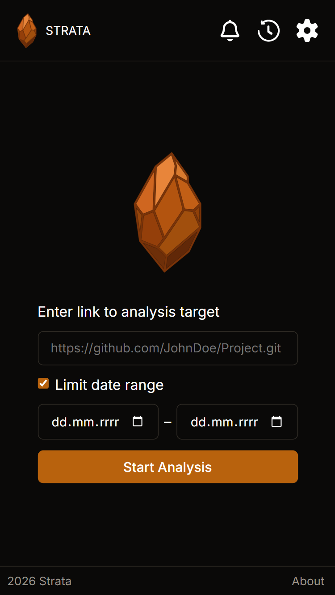
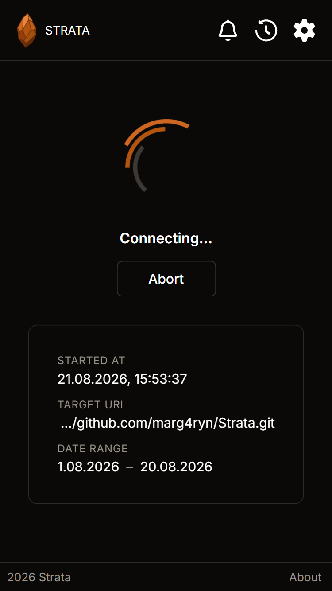
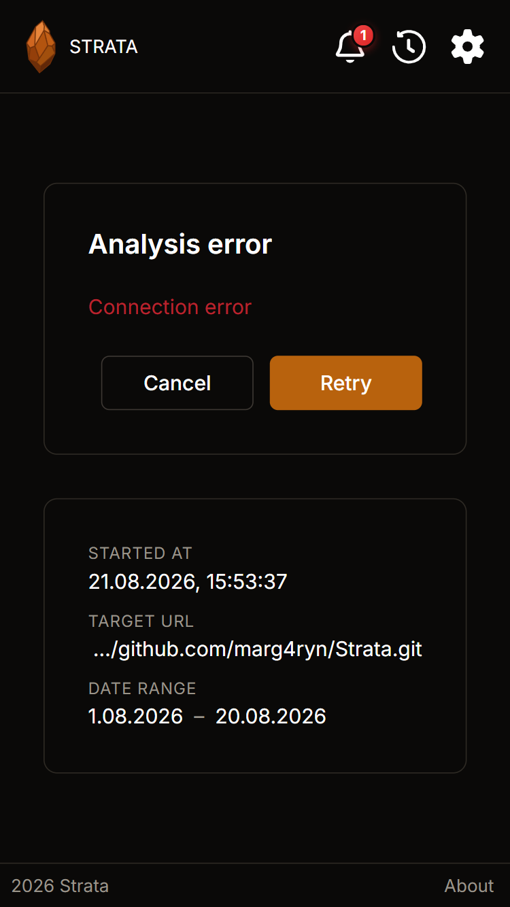
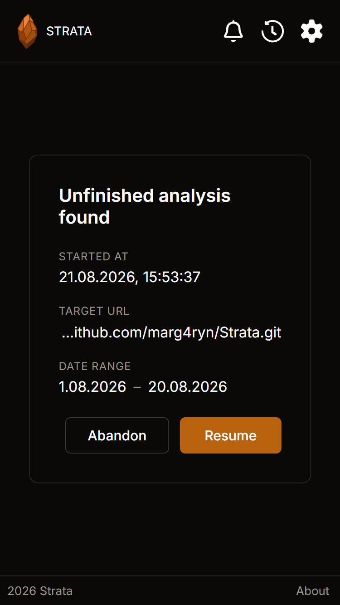
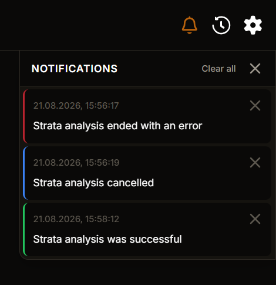
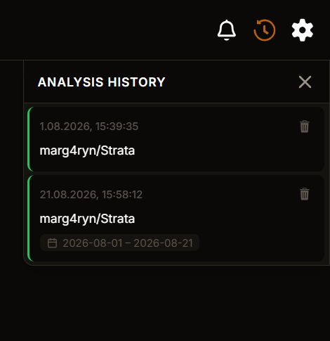
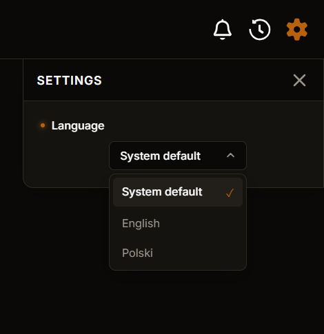
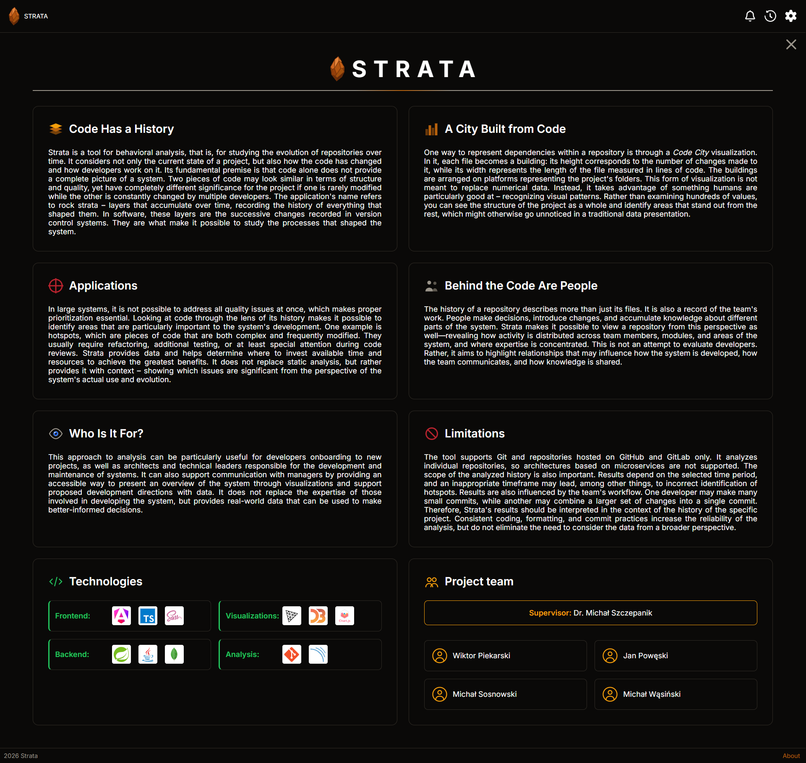

# STRATA

🔗 Backend Repository: https://github.com/marg4ryn/Strata-Backend

> Detailed project documentation can be found in the `docs/` directory. It includes Architecture Decision Record (ADR), the project structure convention, as well as activity and sequence diagrams.

## 🧭 About

**Strata** is a tool for behavioral analysis of software repositories. It uses version control history to study how a codebase evolves over time, going beyond its current state to reveal patterns of development and maintenance. By combining historical activity with structural information about the code, Strata helps identify areas that are particularly important to the evolution of a system and provides context for deciding where maintenance effort may have the greatest impact.

The application's name refers to rock strata – layers that accumulate over time and record the processes that shaped them. In software, these layers are the successive changes recorded in version control, preserving a history of how the system was developed. By examining this history, Strata can reveal **hotspots** – areas of code that are both complex and frequently modified, and therefore often deserve additional attention. Rather than replacing static analysis, Strata adds a historical perspective that helps teams understand which parts of a system matter most in practice and make better-informed decisions about its development and maintenance.

## ✨ Features

### Running Analyses

To start an analysis, the user provides the URL of the target Git repository. Optionally, they can specify a date range to limit the analysis; otherwise, the repository's entire commit history is processed by default (see the **Target Form** below). During the analysis, the application displays real-time progress updates delivered by the server over a WebSocket connection, allowing users to monitor each stage of the process (see the **Loading Screen** below). Multiple analyses can be executed simultaneously in separate tabs, enabling users to work on different repositories independently. Application state is synchronized across browser tabs using Local Storage, while the Web Locks API prevents multiple tabs from competing for the same resources, ensuring consistent and reliable behavior.

If an error occurs or the WebSocket connection is interrupted, the application allows the user to reconnect and resume receiving status updates without restarting the analysis (see the **Analysis Error** below). An analysis continues running even if the application is closed. When the user returns later, Strata automatically detects any unfinished analysis and offers the option to reconnect to it (see the **Unfinished Analysis** below). 

| Target Form | Loading Screen | Analysis Error | Unfinished Analysis |
|:---:|:---:|:---:|:---:|
|  |  |  |  |

### Additional Features

Users can access several application panels directly from the header. All panels are implemented using Angular CDK Overlay, which keeps them independent from the main application layout while providing consistent behavior and accessibility.

Important actions trigger notifications that inform users about the result of an operation. Notifications indicate the message type (`success`, `info`, `warn`, or `error`) and the number of unread notifications is displayed in the application header (see the **Notifications** below).

Each successfully completed analysis is added to the analysis history. Users can open a previous entry to load its results without having to run the analysis again (see the **Analysis History** below). The analysis history state is synchronized between browser tabs using the Broadcast Channel API, ensuring that additions and removals made in one tab are reflected in the others.

The settings panel allows users to change the application language between English and Polish. Translations are handled at runtime using Transloco, allowing the language to be changed without reloading the application (see the **Settings** below).

| Notifications | Analysis History | Settings |
|:---:|:---:|:---:|
|  |  |  |

### About Page

Users interested in the application can visit the About Page, accessible from the application's footer. It presents the development team behind the project and the technology stack used to build the system, and it also documents the tool’s limitations to help users better understand Strata’s purpose and scope (see the **About Page** below).

| About Page |
|:---:|
|  |